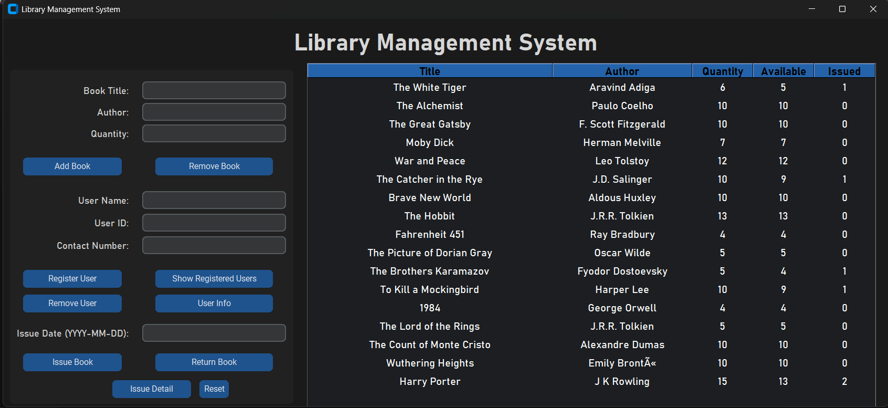

# 📚 Library Management System (Python GUI)

A GUI-based Library Management System developed using Python and CustomTkinter.  
This application allows users to manage books, register users, issue and return books, and store data persistently using a JSON file.

---

## ✨ Features

- Add and remove books from the library  
- Register and remove users  
- Issue and return books with due date calculation  
- View issued book details  
- Display registered users  
- Automatic tracking of:
  - Total books  
  - Available books  
  - Issued books  
- Data persistence using JSON file  
- Modern dark-themed graphical interface  

---

## 🛠️ Tech Stack

- **Language:** Python  
- **GUI Library:** CustomTkinter  
- **Data Storage:** JSON  
- **Modules Used:**  
  - tkinter  
  - customtkinter  
  - datetime  
  - json  
  - os  

---

## 🖥️ User Interface

The application provides a clean and user-friendly GUI for:
- Book management  
- User registration  
- Issue and return operations  
- Displaying library records in tabular form  

---

## 📂 Project Structure

```text
library-management-system/
│
├── main.py
├── book1.json
├── images/home.png
└── README.md
```

